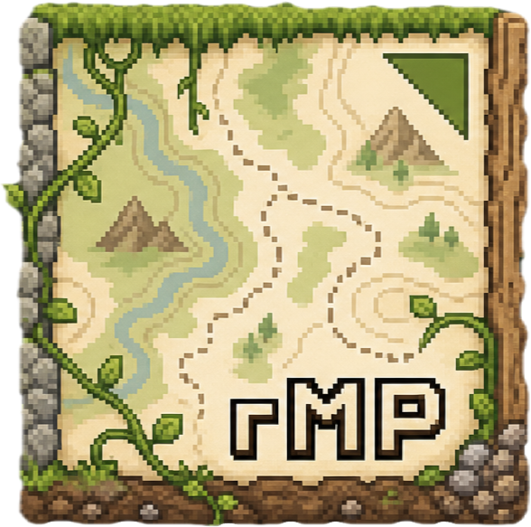

# raylib-map (rMP)



raylib-map (rMP) is a tilemap editor written in C with raylib. It includes a map painter, terrain layers, slicing tools, and export/load workflow.

Features
- Editor executable: `rMP`
- Multi-cell tile support (anchor/occupancy)
- Numeric controls with keyboard input and hold-repeat
- Slice tool (auto grid + manual snap)
- Resizable/collapsible sidebar
- App logo integration (`logo.png` / `logo.icns` / `logo.ico`)

Requirements
- CMake >= 3.16
- pkg-config (Linux/macOS)
- raylib: https://github.com/raysan5/raylib

On macOS you can install raylib with Homebrew:

```bash
brew install raylib pkg-config cmake
```

Build (macOS / Linux)

```bash
./build.sh
```

Build (Windows)

```bat
build_windows.bat
```

Build/Test status
- Verified build and packaging only on macOS (local environment).
- Windows and Linux scripts are prepared but not validated on native hosts in this workspace.

Manual CMake (all platforms)

```bash
cmake -S . -B build-rmp -DCMAKE_BUILD_TYPE=Release
cmake --build build-rmp --config Release
```

Clean and rebuild with a new logo (from project root)

```bash
rm -rf build-rmp
./generate_icons.sh
./build.sh
./package.sh
```

Run

```bash
# macOS app bundle
open build-rmp/bin/rMP.app

# Linux/macOS executable
./build-rmp/bin/rMP

# Windows
build-rmp\\bin\\rMP.exe
```

Package

```bash
./package.sh
```

On Windows:

```bat
package_windows.bat
```

Expected package outputs
- macOS: `.dmg` (DragNDrop) with `.app`
- Windows: `.zip` and `.exe` installer (NSIS, if available)
- Linux: `.tar.gz` (`TGZ`)

Icon assets
- `logo.png` is copied next to runtime output
- `logo.icns` is used for macOS app bundle icon
- `logo.ico` + `app_icon.rc` are used for Windows executable icon

Generate icons from `logo.png`

```bash
./generate_icons.sh
```

If CMake cannot find raylib, ensure `pkg-config --cflags --libs raylib` works in your shell, or set `CMAKE_PREFIX_PATH` / `PKG_CONFIG_PATH` accordingly.

Contributing
- Issues and pull-requests are welcome. Please open issues for bugs or feature requests.
